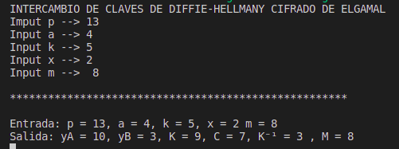
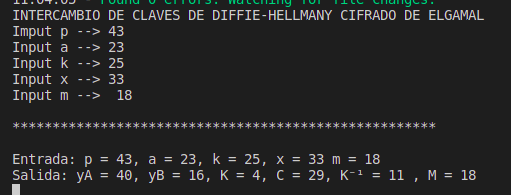
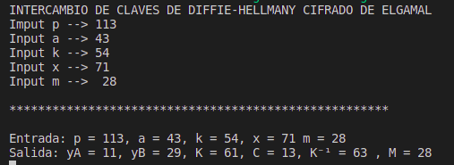

# Pŕactica 8:
## INTERCAMBIO DE CLAVES DE DIFFIE-HELLMANY CIFRADO DE ELGAMAL

* Objetivo: 
  * Implementar el algoritmo de intercambio de claves de Diffie-Hellman y el Cifrado de ElGamal.

* Modo compilación: 
  * `npm install` --> Para instalar todas las dependencias necesarias
  * `npm run start` --> Para compilar y ejecutar el programa

* Video explicativo: 
  * [Vídeo](https://youtu.be/a7-T7ok9a1M)

* Ejemplos de uso: 
  * 
  * 
  * 

